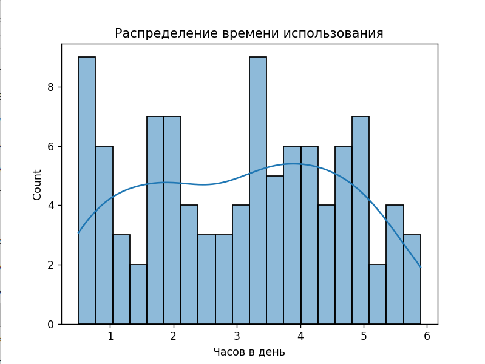
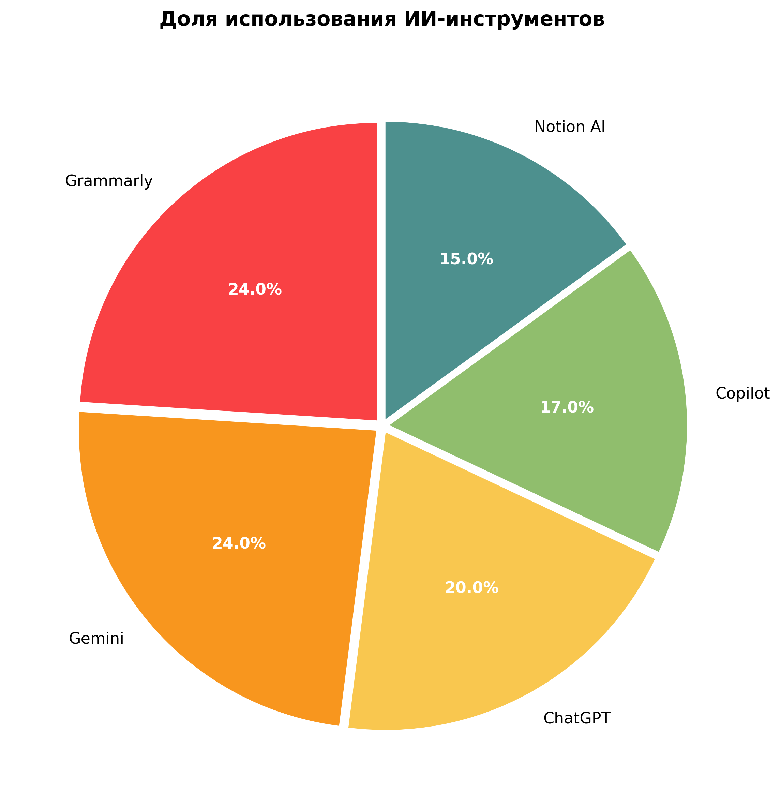
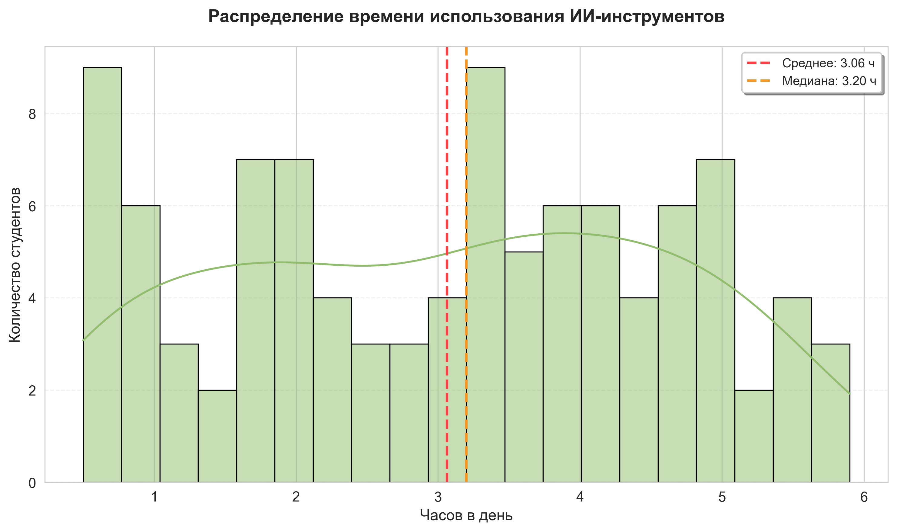
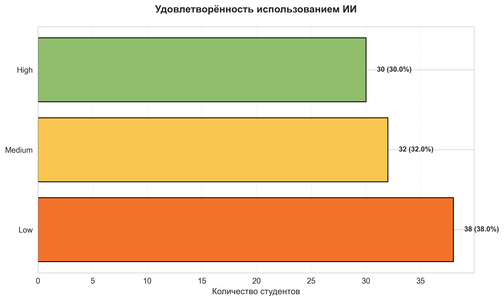

# Анализ: Как использование ИИ инструментов меняет жизнь студентов

## Данные

* Описание: Набор данных, включающий информацию о 100 пакистанских студентах (в возрасте 15–25 лет) из пяти крупных городов.
* Источник: Kaggle
* Колонок: 10 (id, возраст, пол, уровень образования, город, инструмент, время использования в день, цель, влияние на оценки, удовлетворённость)

## Цель анализа

Исследовать, как студенты используют ИИ-инструменты и какое влияние это оказывает на учёбу.

## Этапы анализа

1. Понимание задачи
2. Сбор и загрузка данных
3. Очистка и подготовка
4. Исследовательский анализ
5. Визуализация и инсайты
6. Выводы

---

## Этап 1: Понимание задачи

Есть набор данных о том, как студенты из Пакистана использовали ИИ инструменты в 2026 и как это на них повлияло.

#### Что нужно выяснить

Основной вопрос: 
* Как использование ИИ-инструментов влияет на учебный процесс и успеваемость студентов?

Подвопросы:
* Какие инструменты самые популярные?
* Сколько времени студенты тратят на ИИ?
* Какой процент студентов доволен использованием ИИ?
* Кто самые активные пользователи?
* Кто наиболее недоволен использованием ИИ?

#### Кому это может быть полезно

Преподаватели - Понимать, как студенты используют ИИ, чтобы адаптировать методы обучения

Администрация университетов -Принимать решения о внедрении ИИ-инструментов в учебный план

Студенты - Видеть, как другие используют ИИ, и сравнивать свой опыт

Исследователи - Получать данные для дальнейших исследований в области образования

#### Важно учитывать

Малая выборка (100 человек), самоотчёты (Возможна предвзятость), отсутствуют данные об оценках до/после, неизвестно, для каких дисциплин используется ИИ, нельзя отследить изменения во времени

## Этап 2: Сбор и загрузка данных 

```python
import pandas as pd

df = pd.read_csv('data/AI_Student_Life_Pakistan_2026.csv')
```

## Этап 3: Очистка и подготовка

#### ПОДГОТОВКА И ОЧИСТКА ДАННЫХ

```python
# Сколько пропусков в каждой колонке
print(df.isnull().sum())

``` 
**Вывод:**

Student_ID            0
Age                   0
Gender                0
Education_Level       0
City                  0
AI_Tool_Used          0
Daily_Usage_Hours     0
Purpose               0
Impact_on_Grades      0
Satisfaction_Level    0

**Итог**: нет пропусков


#### Проверка на дубликаты

```python


print(f"Дубликаты: {df.duplicated().sum()}")

```
**Вывод:**

Дубликаты: 0

**Итог:** нет дубликатов

#### Проверка типов данных

```python
print(df.dtypes)


```
**Вывод:**

Student_ID              int64
Age                     int64
Gender                    str
Education_Level           str
City                      str
AI_Tool_Used              str
Daily_Usage_Hours     float64
Purpose                   str
Impact_on_Grades          str
Satisfaction_Level        str

**Итог:** с типами данных всё в порядке

#### Проверка уникальных значений(Ищем опечатки, лишние пробелы, разный регистр)

```python

for col in df.select_dtypes(include='object').columns:
    print(f"\n{col}:")
    vc = df[col].value_counts()
    vc.index.name = None  # Убираем имя индекса
    print(vc)


```
**Вывод:**

Gender:
Female    52
Male      48
Name: count, dtype: int64

Education_Level:
School        46
College       29
University    25
Name: count, dtype: int64

City:
Multan        29
Lahore        22
Islamabad     18
Faisalabad    17
Karachi       14
Name: count, dtype: int64

AI_Tool_Used:
Grammarly    24
Gemini       24
ChatGPT      20
Copilot      17
Notion AI    15
Name: count, dtype: int64

Purpose:
Homework    24
Learning    21
Research    21
Coding      20
Writing     14
Name: count, dtype: int64

Impact_on_Grades:
Improved          39
No Change         34
Slight Decline    27
Name: count, dtype: int64

Satisfaction_Level:
Low       38
Medium    32
High      30
Name: count, dtype: int64

**Итог:** все значения уникальны

#### Распределение времени использования

```python

sns.histplot(df['Daily_Usage_Hours'], bins=20, kde=True)
plt.title('Распределение времени использования')
plt.xlabel('Часов в день')
plt.show()


```
**Вывод:**



**Итог:** нет значительных выбросов. Есть несколько пиков (мультимодальное распределение)


## Этап 4: Исследовательский анализ

### Какие инструменты самые популярные?

```python
total = len(df)
tool_counts = df['AI_Tool_Used'].value_counts()
tool_pct = (tool_counts / total * 100).round(1)

print("Популярность AI-инструментов:")
for tool, count, pct in zip(tool_counts.index, tool_counts.values, tool_pct.values):
    print(f"  {tool:12} {count:3} человек ({pct}%)")
```
**Вывод:**

Популярность AI-инструментов:
  Grammarly     24 человек (24.0%)
  Gemini        24 человек (24.0%)
  ChatGPT       20 человек (20.0%)
  Copilot       17 человек (17.0%)
  Notion AI     15 человек (15.0%)


### Сколько времени студенты тратят на ИИ?

```python
# Основные метрики
print("Время использования AI (часов в день):")
print(f"  Среднее:   {df['Daily_Usage_Hours'].mean():.2f}")
print(f"  Медиана:   {df['Daily_Usage_Hours'].median():.2f}")
print(f"  Минимум:   {df['Daily_Usage_Hours'].min():.2f}")
print(f"  Максимум:  {df['Daily_Usage_Hours'].max():.2f}")
print(f"  Стандартное отклонение: {df['Daily_Usage_Hours'].std():.2f}")

# Процентили
print(f"  25% студентов тратят ≤ {df['Daily_Usage_Hours'].quantile(0.25):.2f} ч")
print(f"  50% студентов тратят ≤ {df['Daily_Usage_Hours'].quantile(0.50):.2f} ч (медиана)")
print(f"  75% студентов тратят ≤ {df['Daily_Usage_Hours'].quantile(0.75):.2f} ч")
print(f"  90% студентов тратят ≤ {df['Daily_Usage_Hours'].quantile(0.90):.2f} ч")
```
**Вывод:**

Время использования AI (часов в день):
  Среднее:   3.06
  Медиана:   3.20
  Минимум:   0.50
  Максимум:  5.90
  Стандартное отклонение: 1.56
  25% студентов тратят ≤ 1.80 ч
  50% студентов тратят ≤ 3.20 ч (медиана)
  75% студентов тратят ≤ 4.30 ч
  90% студентов тратят ≤ 5.00 ч

### Какой процент студентов доволен использованием ИИ?

```python
total = len(df)
sat_counts = df['Satisfaction_Level'].value_counts()
sat_pct = (sat_counts / total * 100).round(1)

print("Удовлетворённость использованием ИИ:")
for level, count, pct in zip(sat_counts.index, sat_counts.values, sat_pct.values):
    print(f"  {level:10} {count:3} студента ({pct:.1f}%)")
```
**Вывод:**

Удовлетворённость использованием ИИ:
  Low         38 студента (38.0%)
  Medium      32 студента (32.0%)
  High        30 студента (30.0%)

### Кто самые активные пользователи?

```python

# Находим Топ-25% самых активных
threshold = df['Daily_Usage_Hours'].quantile(0.75)  # 75-й процентиль
active_users = df[df['Daily_Usage_Hours'] >= threshold]

print(f"Топ-25% активных (≥{threshold:.1f} ч/день): {len(active_users)} человек")


# Исследуем самых активных пользователей
print("\nПОРТРЕТ АКТИВНОГО ПОЛЬЗОВАТЕЛЯ:")

print(f"\nВозраст:")
print(f"  Средний: {active_users['Age'].mean():.1f} лет")
print(f"  Диапазон: {active_users['Age'].min()}–{active_users['Age'].max()} лет")

print(f"\nПол:")
print(active_users['Gender'].value_counts().apply(lambda x: f"{x} ({x/len(active_users)*100:.1f}%)"))

print(f"\nОбразование:")
print(active_users['Education_Level'].value_counts().apply(lambda x: f"{x} ({x/len(active_users)*100:.1f}%)"))

print(f"\nЛюбимые инструменты(топ-3):")
print(active_users['AI_Tool_Used'].value_counts().head(3).apply(lambda x: f"{x} человек  ({x/len(active_users)*100:.1f}%)"))

print(f"\nОсновные цели(топ-3):")
print(active_users['Purpose'].value_counts().head(3).apply(lambda x: f"{x} человек  ({x/len(active_users)*100:.1f}%)"))

print(f"\nВлияние на оценки:")
impact_pct = active_users['Impact_on_Grades'].value_counts(normalize=True) * 100
for impact, pct in impact_pct.items():
    print(f"  {impact}: {pct:.1f}%")

print(f"\nУдовлетворённость:")
sat_pct = active_users['Satisfaction_Level'].value_counts(normalize=True) * 100
for sat, pct in sat_pct.items():
    print(f"  {sat}: {pct:.1f}%")

```
**Вывод:**

Топ-25% активных (≥4.3 ч/день): 26 человек

ПОРТРЕТ АКТИВНОГО ПОЛЬЗОВАТЕЛЯ:

Возраст:
  Средний: 18.7 лет
  Диапазон: 15–23 лет

Пол:
Gender
Male      14 (53.8%)
Female    12 (46.2%)
Name: count, dtype: str

Образование:
Education_Level
School        13 (50.0%)
College        7 (26.9%)
University     6 (23.1%)
Name: count, dtype: str

Любимые инструменты(топ-3):
AI_Tool_Used
ChatGPT      7 человек  (26.9%)
Gemini       6 человек  (23.1%)
Grammarly    5 человек  (19.2%)
Name: count, dtype: str

Основные цели(топ-3):
Purpose
Homework    8 человек  (30.8%)
Coding      8 человек  (30.8%)
Research    5 человек  (19.2%)
Name: count, dtype: str

Влияние на оценки:
  Improved: 46.2%
  Slight Decline: 30.8%
  No Change: 23.1%

Удовлетворённость:
  Low: 46.2%
  Medium: 26.9%
  High: 26.9%


### Кто наиболее недоволен использованием ИИ?

```python
# Фильтр: только недовольные
unhappy_users = df[df['Satisfaction_Level'] == 'Low']

print(f"Недовольных пользователей: {len(unhappy_users)} человек ({len(unhappy_users)/len(df)*100:.1f}%)")

# Обрабатываем недовольных пользователей
print("\nПОРТРЕТ НЕДОВОЛЬНОГО ПОЛЬЗОВАТЕЛЯ:")

print(f"\nВозраст:")
print(f"  Средний: {unhappy_users['Age'].mean():.1f} лет")
print(f"  Диапазон: {unhappy_users['Age'].min()}–{unhappy_users['Age'].max()} лет")

print(f"\nПол:")
gender_dist = unhappy_users['Gender'].value_counts()
for gender, count in gender_dist.items():
    pct = count / len(unhappy_users) * 100
    print(f"  {gender}: {count} ({pct:.1f}%)")

print(f"\nОбразование:")
edu_dist = unhappy_users['Education_Level'].value_counts()
for edu, count in edu_dist.items():
    pct = count / len(unhappy_users) * 100
    print(f"  {edu}: {count} ({pct:.1f}%)")


print(f"\nВремя использования:")
print(f"  Среднее: {unhappy_users['Daily_Usage_Hours'].mean():.2f} ч/день")
print(f"  Медиана: {unhappy_users['Daily_Usage_Hours'].median():.2f} ч/день")

print(f"\nИнструменты:")
tools = unhappy_users['AI_Tool_Used'].value_counts().head(3)
for tool, count in tools.items():
    print(f"  {tool}: {count} студента  ({len(unhappy_users)/len(df)*100:.1f}%)")

print(f"\nЦели использования:")
purposes = unhappy_users['Purpose'].value_counts().head(3)
for purpose, count in purposes.items():
    print(f"  {purpose}: {count} студента  ({len(unhappy_users)/len(df)*100:.1f}%)")

print(f"\nВлияние на оценки:")
impact = unhappy_users['Impact_on_Grades'].value_counts(normalize=True) * 100
for level, pct in impact.items():
    print(f"  {level}: {pct:.1f}%")
```


**Вывод:**

ПОРТРЕТ НЕДОВОЛЬНОГО ПОЛЬЗОВАТЕЛЯ:

Возраст:
  Средний: 18.9 лет
  Диапазон: 15–25 лет

Пол:
  Female: 19 (50.0%)
  Male: 19 (50.0%)

Образование:
  School: 16 (42.1%)
  College: 16 (42.1%)
  University: 6 (15.8%)

Время использования:
  Среднее: 3.31 ч/день
  Медиана: 3.70 ч/день

Инструменты:
  Grammarly: 11 студента  (38.0%)
  Gemini: 9 студента  (38.0%)
  ChatGPT: 7 студента  (38.0%)

Цели использования:
  Coding: 9 студента  (38.0%)
  Homework: 9 студента  (38.0%)
  Writing: 7 студента  (38.0%)

Влияние на оценки:
  Improved: 39.5%
  No Change: 34.2%
  Slight Decline: 26.3%

## Этап 5: Визуализация и инсайты

### Основные визуализации

#### Популярность ИИ-инструментов
```python

# Подготавливаем данные
tool_counts = df['AI_Tool_Used'].value_counts()
total = len(df)

# Задаём цветовую палитру
colors = ['#f94144', '#f8961e', '#f9c74f', '#90be6d', '#4d908e']

# Создаём холст
plt.figure(figsize=(8, 8))

# Рисуем круговую диаграмму
wedges, texts, autotexts = plt.pie(
    tool_counts.values,
    labels=tool_counts.index,
    autopct='%1.1f%%',
    colors=colors,
    startangle=90,
    explode=[0.025] * len(tool_counts),
    textprops={'fontsize': 11}
)

# Улучшаем читаемость процентов: делаем их белыми и жирными
for autotext in autotexts:
    autotext.set_color('white')
    autotext.set_fontweight('bold')

# Добавляем заголовок
plt.title(
    'Доля использования ИИ-инструментов',
    fontsize=14,
    fontweight='bold',
    pad=20
)

# Автоматически подгоняем отступы, чтобы ничего не обрезалось
plt.tight_layout()

# Сохраняем график в файл
plt.savefig(
    'images/tools_pie.png',
    dpi=300,
    bbox_inches='tight',
    facecolor='white'
)

# Показываем график в отдельном окне
plt.show()

```



#### Распределение времени использования

```python

# Настраиваем стиль и размер графика
sns.set_style("whitegrid")
plt.rcParams['figure.figsize'] = (10, 6)
plt.rcParams['font.size'] = 11

# Извлекаем данные для анализа
hours = df['Daily_Usage_Hours']

# Создаём фигуру
plt.figure()

# Рисуем гистограмму с KDE-кривой
sns.histplot(
    data=df,
    x='Daily_Usage_Hours',
    bins=20,
    kde=True,
    color='#90be6d',
    edgecolor='black',
    linewidth=0.8,
    alpha=0.5
)

# Добавляем вертикальные линии: среднее и медиана
plt.axvline(
    hours.mean(),
    color='#f94144',
    linestyle='--',
    linewidth=2,
    label=f'Среднее: {hours.mean():.2f} ч'
)
plt.axvline(
    hours.median(),
    color='#f8961e',
    linestyle='--',
    linewidth=2,
    label=f'Медиана: {hours.median():.2f} ч'
)

# Оформление: заголовок и подписи осей
plt.title(
    'Распределение времени использования ИИ-инструментов',
    fontsize=14,
    fontweight='bold',
    pad=20
)
plt.xlabel('Часов в день', fontsize=12)
plt.ylabel('Количество студентов', fontsize=12)

# Добавляем легенду (для линий среднего и медианы)
plt.legend(fontsize=10, frameon=True, shadow=True)

# Добавляем лёгкую сетку по оси Y для читаемости
plt.grid(axis='y', alpha=0.3, linestyle='--')

# Автоматически подгоняем отступы
plt.tight_layout()

# Сохраняем график в высоком качестве
plt.savefig(
    'images/usage_distribution.png',
    dpi=300,
    bbox_inches='tight',
    facecolor='white'
)

# Показываем график
plt.show()
```




#### Удовлетворённость использованием ИИ

```python

# Горизонтальный барчарт
plt.figure(figsize=(10, 6))

# Данные с порядком
sat_counts = df['Satisfaction_Level'].value_counts().reindex(['Low', 'Medium', 'High'])
colors = ['#f3722c', '#f9c74f', '#90be6d']

# Рисуем горизонтальные столбцы
bars = plt.barh(
    sat_counts.index,
    sat_counts.values,
    color=colors,
    edgecolor='black',
    linewidth=1.2
)

# Подписи столбцов
for bar in bars:
    width = bar.get_width()
    pct = width / total * 100
    plt.text(
        width + 1,
        bar.get_y() + bar.get_height()/2,
        f'{int(width)} ({pct:.1f}%)',
        va='center',
        fontweight='bold',
        fontsize=10
    )

# Оформление
plt.title('Удовлетворённость использованием ИИ', fontsize=14, fontweight='bold', pad=20)
plt.xlabel('Количество студентов', fontsize=12)
plt.ylabel('')
plt.xticks(fontsize=11)
plt.grid(axis='x', alpha=0.3, linestyle='--')
plt.tight_layout()

plt.savefig('images/satisfaction_bar_h.png', dpi=300, bbox_inches='tight', facecolor='white')
plt.show()

```





### Основные инсайты

1. Grammarly и Gemini - самые популярные инструменты (по 24% каждый). Это указывает на высокий спрос на помощь с текстом и генерацией контента.
2. Только 30% студентов довольны использованием ИИ, а 38% выражают недовольство. Есть значительный разрыв между ожиданиями и реальностью.
3. Студенты тратят в среднем 3.06 часа в день на ИИ (медиана: 3.20 ч). 75% студентов используют не более 4.3 часов в день
4. Самые активные пользователи (топ-25%, ≥4.3 ч/день) - чаще школьники (50%), но при этом 46% из них недовольны опытом. Возможно, им не хватает навыков эффективного использования.
5. Среди недовольных пользователей 39.5% всё же отмечают улучшение оценок. Проблема может быть не в результате, а в процессе.

---
## Структура проекта

student-ai-analysis/
├── data/
│   └── AI_Student_Life_Pakistan_2026.csv
├── images/
│   ├── distribution.png
│   ├── usage_distribution.png
│   ├── satisfaction_bar_h.png
│   └── tools_pie.png
├── analysis.py
├── requirements.txt
└── README.md
  

